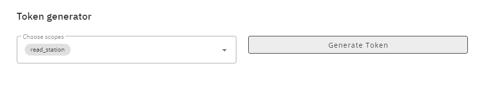

# netatmo-influx-importer
Go CLI which can be run as cron to import netatmo data into influx 2.0 database.

## Usage
You need to follow following steps:
- [Create a new netatmo app](https://dev.netatmo.com/dev/createapp)
- Generate a new token using the token generator. Scope needed is `read_station`: 
- Optional: Create a seperate Bucket and Token for adding the netatmo data to it.
- Place the script somewhere on your server. 
1. Download and Upload program to your Server. You find it under [Releases](https://github.com/joshuabeny1999/netatmo-influx-importer/releases/latest) (Check your ARM architecture with `dpkg --print-architecture`) 
2. Untar it where you want it: `tar -xvzf netatmo-influx-importer_x.y.z_Linux_amd64.tar.gz`
3. Make it executeable: `chmod +x netatmo-influx-importer`

- Create a ```config.yml``` in the same folder of the program with Influx and Netatmo configuration (See also ```sample_config.yml```):
```yml
# Create a Netatmo developer account and fill in here the details:
netatmo:
  client_id: NETATMO_CLIENT_ID
  client_secret: NETATMO_CLIENT_SECRET
  refresh_token: NETATMO_REFRESH_TOKEN

# Fill in here influx details
influx:
  url: http://localhost:8086
  token: my-token
  bucket: my-bucket
  org: my-org
```
- Add a cronjob  to run script regulary (Recommended every 5 minute)
```
# cat /etc/cron.d/netatmo
*/5 * * * * root  /path/to/netatmo-influx-importer 
```

> :information_source: With the argument ```--config``` you could provide the path to the config file if you place it elsewhere on the server.

## Breaking Change December 2023
Netatmo invalidated all refresh token and generated a new one on each request. Therefore please make sure config file is writeable by the user running the script, so it can update the refresh token if it changed.

You need to regenarate your token and update your configuration file to get it working again if it broke on your side.